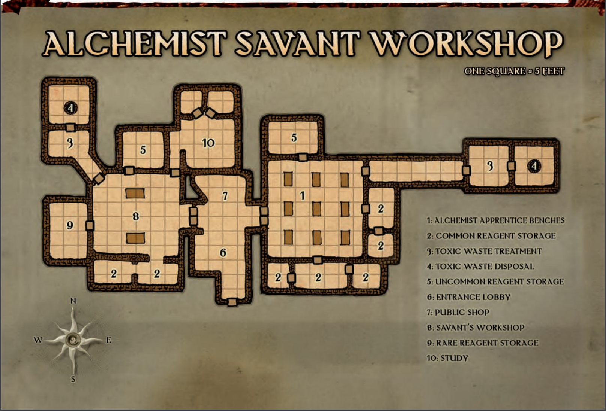

# Scenario 4: Genesys Station

Music:

Bioshock-themed dungeon, doubling as a sort of holy sanctuary for the Deep Ones. The facility resembles an underwater fortress.

Reference: [https://thetrove.net/Books/Warhammer/40000/Warhammer 40k Xenology.pdf](https://thetrove.net/Books/Warhammer/40000/Warhammer%2040k%20Xenology.pdf)

---

## NPCs

* Scott Westerfeld - An ageing halfling with stringy grey hair and a scraggly beard, only his sharp eyes and stained (but mismatched) noble attire mark him out as someone important. Westerfeld is first and foremost a businessman, and is always looking to make a deal. Represents House Jorasco.

---

## Cave System

***Egg Chamber***

Every surface of the egg-shaped chamber is coated in that organic secretion, and hundreds of glistening, green egglike structures are mounted within it. These range in size from just 6 inches (15 cm) long to being almost as tall as a human.

An exit leads out of the chamber to the south, but that opening is mostly covered by the spongy matter and thus not immediately obvious (nor is it shown on the map). 

The Eggs: Despite their appearance, the green structures aren’t eggs. A better analogy might be seed pods or fungal fruiting bodies. Close examination of the base of each pod reveals the twisted remains of human corpses that have been cultivated for their biomass. In other words, the pods have grown out of the corpses, and most of the flesh and bones have been liquefied, incorporated into the base of the pod, and hardened into the new shape. The pods hold one stage of the development of an alien creature, although this stage has two bodies, not one.

## Entrance

A flight of rickety metal stairs leads to a catwalk that runs the perimeter of the middle floor, missing grating in several places. A single fogged window has been boarded up. Several vents and pipes open to the lower floors. The rear door exits onto a gantry walkway scored by recent wand discharges and bullet impacts. The heavy folding door of the loading ramp opens to a sheer drop below.

*(2)*

The facilities seem barely functional, and the surrounding areas are rife with failing machinery, inoperable lumen fixtures, and collapsing gantries and corridors. A noxious fog rises up from below, suffusing the area and reducing visibility. Liquid ceaselessly drips down from the ceiling, a filthy liquid combining effluent, toxic by-products, and simple grime. The constant drainage coats the area in a greasy, foul-smelling slime. Though there is no immediate danger from this liquid, an observer cannot help but wonder if the miasma contributes to the universally sickly nature of the specimen present.

*Emerald Claw Inspiration*

The Factorum Mortuarius is a colossal structure which sprawls
over many levels, connected to the Gallowsway by various tunnels
and conveyors constantly moving in fresh dead and expelling their
rendered remains. Workers and lowly Tech-Priests tend to the
process, scuttling about the blood-soaked machinery like sluggish
beetles. There are some secret ways to reach the Mortuarius, such as
old vent shafts and hidden drainage ducts, but unless the Acolytes
pry this information from a cultist or somehow track down ancient
Administratum records of the area, they must use more direct
routes. These would be along the Avenue of the Dead (which
links all the Mortuarius with the centre of the Gallowsway) or the
tunnel from Charnel House 17. The Mortuarius is then divided into
a number of areas, each blending into the next, which the Acolytes
must traverse to reach the office and any useful information.

Body Dock: The entrance to the Mortuarius is a huge
chamber where the corpses are gathered, processed, and categorised
before being sent to the various other areas of the factorum for
disassembly and destruction. Larger than the storage racks at the
Charnel House, the Dock contains thousands of bodies stacked
from floor to ceiling awaiting their turn on the conveyor. Often
indistinguishable from the corpses, hunched workers in ragged
coveralls move among the dead, loading them onto the conveyors
and checking for anything of worth they might pilfer.

Blood-Wash: The first of the processes is the Blood-Wash,
where fluids are drained from the corpses and divided into useful
products. As the bodies travel down the conveyors, great syringestudded machines draw out their liquids, pumping them down a
tangle of pipes and tubes dividing it by type. The machines are
ancient, and so prone to clogging and jamming that they must
be constantly washed with hoses from above or manually cleared.
Years of clogging and the constant drip and drizzle of leaking
pipes has left the whole floor of the blood-wash waste-deep in foul
water, oil, and a multi-coloured cocktail of bodily fluids.

Flensing Pits: Once the bodies have been drained, a series of
thrashers strip away the desiccated remains, along with clothes and
any remaining possessions. Whirling blades and hacking knives
take care of most of the meat, and acid sprays rinse the remnants
away. Straying from the gantries over the Flensing Pits is extremely
dangerous; there are pockets of air thick with acid compounds,
and the savage shredding machines do not discriminate between
the living and the dead

*Overseer’s Office:* Suspended above the Bone Grinder
on one edge of the dome is the Overseer’s Office, from where
Darnis Fayne (and his brothers before him) conducted the affairs
of the Mortuarius. Now it is sealed, awaiting Ferrue’s instruction
as to who will take over, and still contains much in the way of
incriminating evidence against the Faynes as to their operations.

*The Enlightened Ones*

This area is a maze of damaged controls and broken machinery. Countless wires twist their way across the walls, erupting from control panels that have been pulled apart to lay bare their internal components. Five clear canisters connected by metal tubing and wires line the walls, each one filled with viscous fluid— and what appears to be a humanoid brain.

*The Central Atrium*

The central atrium of the facility appears encapsulated by glass walls containing a vast amount of water, spanning the height from floor to ceiling, the water's surface level remaining out of site. The illuminated coral floor ahead falls away in a marked declivity, and bears curiously regular blocks of stone in certain places, disposed as if in accordance with definite patterns. You see an extended and elaborate array of ruined edifices; magnificent though unclassified architecture in various stages of preservation. Most appear to be of marble, gleaming whitely in the rays of light given off by softly illuminating everbright lanterns. Numerous isolated temples and villas appear on the steep slopes toward the far side.

You examine the scene more closely, and behold the remains of stone and marble bridges and sea-walls, and terraces and embankments once verdant and beautiful. At the end of the city, facing a cliff wall, you are confronted by the richly ornate and perfectly preserved facade of a great building, evidently a temple, hollowed from the solid rock. Of the original workmanship of this titanic object you can only make conjectures. The facade, of immense magnitude, apparently covers a continuous hollow recess; for its windows are many and widely distributed. In the center yawns a great open door, reached by an impressive flight of steps, and surrounded by exquisite carvings in relief. Foremost of all are the great columns and frieze, both decorated with sculptures of inexpressible beauty; obviously portraying idealized pastoral scenes and processions of priests and priestesses bearing strange ceremonial devices in adoration of a radiant god. The art is of the most phenomenal perfection, and imparts an impression of terrible antiquity, as though it were the remotest rather than the immediate ancestor of elven art. You cannot doubt that every detail of this massive product was fashioned from the virgin hillside rock of the cliff wall. It is palpably a part of the valley wall, though how the vast interior was ever excavated you cannot imagine. Perhaps a cavern or series of caverns furnished the nucleus. Neither age nor submersion has corroded the pristine grandeur of this temple—for temple indeed it must be— it rests untarnished and inviolate in the endless night and silence of the chasm.

Convoys of warforged being transported. Genetic experimentation, lab notes, etc.

Boss Fights: Lord Charoth ir’Arkenen d'Cannith

**Factorum Mortuarius** *(see Dark Heresy, Gamemaster's Kit)*

(1) *Factorum Mortuarius -* a mortician / dead preparation centrum; could provide undead resources for Vol's army (a portion of which initially collected by the *Corpse Collectors* and stored in Atur's "cold storage"); the Mourning, thus, created an indefinite number of salvageable corpses for this purpose.

Additionally, this factory is operated by warforged; thus those entering / exiting the mists of the Mourning are constructs and undead; the mists offer cover for the operation.

---

## Voice Recordings

---
## Journal Entries

"Hopelessly lost. For a moment, I conjectured at the slightest possilbility of finding a path through this godforsaken labyrinth, though to my inerrant dismay I found such hope to be wavering, such effort to be worthless endeavor. I must push forward, so I reasoned.

The winding paths offered no sense of familiarity; I found myself passing ill-made shelters, likely the works of a long-deceased dwarven civilization, though the racial assessment of the builders was all but speculative. The lubrious air of the underground world, with its steady, uniform temperature and unsanitary dust particles obscuring even the faintest of lights weighted on me. Already my torch has begun to expirel soon I would be enveloped by the total and almost palpable blackness of the bowels of the earth.