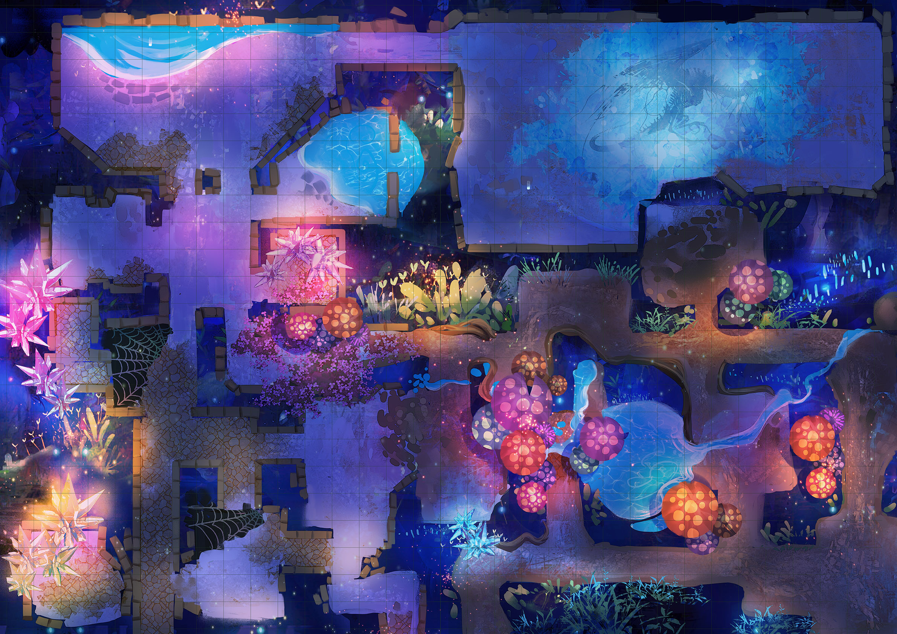
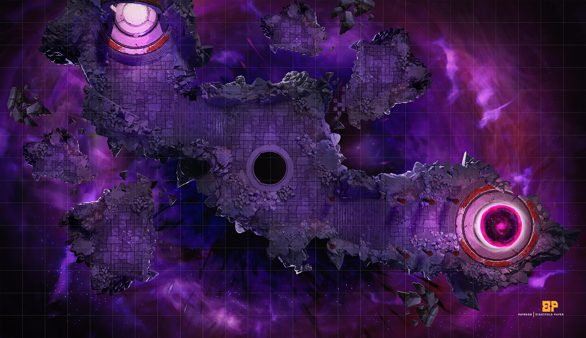

# Scenario 4: Genesys Station

Music:

Bioshock-themed dungeon, doubling as a sort of holy sanctuary for the Deep Ones. The facility resembles an underwater fortress.

Reference: [https://thetrove.net/Books/Warhammer/40000/Warhammer 40k Xenology.pdf](https://thetrove.net/Books/Warhammer/40000/Warhammer%2040k%20Xenology.pdf)

---
## Background
The Genesys Station was constructed shortly after news hit the Korranberg press of fishermen on the southern shore of Lake Cyre discovering fish exhibiting strange mutations of an aberrant nature. Similar findings were reported months prior near the archipelago where Scion Sound meets Karrn Bay. Around the same time, expected shipments of "goods and services", primarily between the Western Principalities and northern Karrnathian markets missed their respective delivery dates, the cargo ships in question never reaching their intended destination nor returning to their points of origin. This news attracted attention. House Cannith began arranging expeditions employing the use of submersive vessels to explore the depths of Lake Cyre. The house later reported finding the remnants of several Lyrandar stormships at various points beneath the water's surface, concluding the shipwrecks were due to the unjust nature of Talenta torrents.*

However, what the Dragonmarked House did not report was their discovery of a strange phenomenon present in local tribes of sahaugin. These sahaugin were far more aggressive than their peacekeeping relatives, exemplifying characteristics of strength and natural regeneration. The tribes conglomerated around vent faults that appeared to plummet into the depths of Khyber at the substratum of Kraken Bay.

---
Why this is important:
* What if Sorrif was among one of these trade vessels?
  * Windspyre, a darkwood convoy ship repurposed as a mercantile vessel following the end of the war.
* This news should aleady be perplexing as Lyrandar stormships are ensured to be able to withstand any feats of weather.
* Empasize the purposes of the research is to manufacture (whether genetically or artificially) the perfect host.
---

## NPCs

- **Scott Westerfeld d'Cannith**- An ageing man with stringy grey hair and a scraggly beard, only his sharp eyes and stained (but mismatched) noble attire mark him out as someone important. Westerfeld is first and foremost a businessman, and is always looking to make a deal. 
  * Scott is actually an illithid - his entire office is a breeding chamber disguised via hallucinatory terrain. Those with *true sight* should be informed through private message.
- **Everyn Korell d'Cannith**: chief artificer, minister of the Orphanage, a secret Cannith facility in Karrnath. He is one of the presumed dead in the accident which destroyed the site's creation forge and facility in Therendor, 992 YK.
- **Franklin T. Danielles d'Cannith**, well-known artificer
- **Lady Adassa Sano d'Cannith**, previously a scavenger and investor who betrayed Fangli Towger with a promise of delivering sanctifiable warforged. Now she operates as a leading executive in the marketing department.
    - **Tabak Verna d'Cannith**, accomplice of Adassa
    - **Novalie Marthea d'Cannith**, accomplice of Adassa

For Quori stats, see Faithful of Eberron. Excellent 5e stat blocks for Inspired and Quori. See **Inspired Bastion Lord (CR 17)** and **Kalaraq Quori (CR 20).**

**Operation: Strain #773b, City-wide Experiment #1**

Coined "The Orphanage", the joint innovative effort between House Vadalis, House Jorasco and House Cannith specializing in lifeform almagamation, genetic enhancements, and research of exotic creatures.

- House Jorasco: interested in replicating the regenerative capabilities of the deep ones
- House Cannith: under the guise of neutrality, Cannith has chosen to empower Karrnath through developing a necrotic weapon industry
    - An effort that could cost the already poor reputation of the house.
    - the Emerald Claw have become the primary backers, utilizing the developments in terroristic activities
- House Vadalis: bioweapons program: seeking to unlock and replicate the supernatural abilities of the deep ones for human modification (mage-breeding).

 

## Cave System

---

Luminescent fungus, shedding a pale violet light, clings to the walls and ceiling of this wide, water adjacent cavern. The air is damp, chilly, and redolent with the odors of loam and decay. A layer of earth, mixed with rotting vegetation and the remains of amphibious cave specimen and the corpses of preserved, fallen soldiers (Cyran) decorate the floor. Despite the almost temperate heat of the cave complex, the corpses are covered with frost.
- Further down (~60ft), the sound of a hissing gas pipe can be heard. The caverns converge at a single point where the players will be hindered by an earthen barrier, a collapsed tunnel blocking further access. Historically, this tunnel was purposefully collapsed to prevent scouting regiments from finding alternate routes around armies.
- *History:* Pierce was among these regiments, under the command of Rhysimor Maceck, a Cyran battlefield commander who led his platoon on a scouting mission into a cliffside cave complex on the southern shore of Lake Cyre. The entry way collapsed upon the regiment's discovery and Rhysimor returned from the expedition as the sole-survivor. Pierce would later accept mercenary work (Breland, Thrane and now, Aundair).

***Egg Chamber***

Every surface of the egg-shaped chamber is coated in that organic secretion, and hundreds of glistening, green egglike structures are mounted within it. These range in size from just 6 inches (15 cm) long to being almost as tall as a human.

An exit leads out of the chamber to the south, but that opening is mostly covered by the spongy matter and thus not immediately obvious (nor is it shown on the map). 

The Eggs: Despite their appearance, the green structures aren't eggs. A better analogy might be seed pods or fungal fruiting bodies. Close examination of the base of each pod reveals the twisted remains of human corpses that have been cultivated for their biomass. In other words, the pods have grown out of the corpses, and most of the flesh and bones have been liquefied, incorporated into the base of the pod, and hardened into the new shape. The pods hold one stage of the development of an alien creature, although this stage has two bodies, not one.

 

## Genesys Station
---

The Genesys Station is a colossal structure which sprawls
over many levels, connected to the Gallowsway by various tunnels
and conveyors constantly moving in fresh dead and expelling their
rendered remains. Workers and lowly warforged tend to the
process, scuttling about the blood-soaked machinery like sluggish
beetles. There are some secret ways to reach the station, such as
old vent shafts and hidden drainage ducts, but unless the players
pry this information from a cultist or somehow track down ancient
Administratum records of the area, they must use more direct
routes.

A flight of rickety metal stairs leads to a catwalk that runs the perimeter of the middle floor, missing grating in several places. A single fogged window has been boarded up. Several vents and pipes open to the lower floors. The rear door exits onto a gantry walkway scored by recent wand discharges and bullet impacts. The heavy folding door of the loading ramp opens to a sheer drop below.

The facilities seem barely functional, and the surrounding areas are rife with failing machinery, inoperable lumen fixtures, and collapsing gantries and corridors. A noxious fog rises up from below, suffusing the area and reducing visibility. Liquid ceaselessly drips down from the ceiling, a filthy liquid combining effluent, toxic by-products, and simple grime. The constant drainage coats the area in a greasy, foul-smelling slime. Though there is no immediate danger from this liquid, an observer cannot help but wonder if the miasma contributes to the universally sickly nature of the specimen present.

*The Central Atrium*

The halls of the facility appear to be constructions of translucent glass walls; providing a view hub into the sea floor. The illuminated coral floor ahead falls away in a marked declivity, and bears curiously regular blocks of stone in certain places, disposed as if in accordance with definite patterns. You see an extended and elaborate array of ruined edifices; magnificent though unclassified architecture in various stages of preservation. Most appear to be of marble, gleaming whitely in the rays of light given off by softly illuminating everbright lanterns.

You examine the scene more closely, and behold the remains of stone and marble bridges and sea-walls, and terraces and embankments once verdant and beautiful. At the end of the city, facing a cliff wall, you are confronted by the richly ornate and perfectly preserved facade of a great building, evidently a temple, hollowed from the solid rock. Of the original workmanship of this titanic object you can only make conjectures. The facade, of immense magnitude, apparently covers a continuous hollow recess; for its windows are many and widely distributed. In the center yawns a great open door, reached by an impressive flight of steps, and surrounded by exquisite carvings in relief. Foremost of all are the great columns and frieze, both decorated with sculptures of inexpressible beauty; obviously portraying idealized pastoral scenes and processions of priests and priestesses bearing strange ceremonial devices in adoration of a radiant god. The art is of the most phenomenal perfection, and imparts an impression of terrible antiquity, as though it were the remotest rather than the immediate ancestor of elven art. You cannot doubt that every detail of this massive product was fashioned from the virgin hillside rock of the cliff wall. It is palpably a part of the valley wall, though how the vast interior was ever excavated you cannot imagine. Perhaps a cavern or series of caverns furnished the nucleus. Neither age nor submersion has corroded the pristine grandeur of this temple—for temple indeed it must be— it rests untarnished and inviolate in the endless night and silence of the chasm.

***Body Dock:*** The entrance to the station is a huge
chamber where the corpses are gathered, processed, and categorised
before being sent to the various other areas of the factorum for
disassembly and destruction. Larger than the storage racks at the
Charnel House, the Dock contains thousands of bodies stacked
from floor to ceiling awaiting their turn on the conveyor. Often
indistinguishable from the corpses, hunched workers in ragged
coveralls move among the dead, loading them onto the conveyors
and checking for anything of worth they might pilfer.

### TODO: @jgreenlee24 - Add underwater ships convoying warforged shells (hollows) to and from the facility. This should also be the point of departure for the train.

 

***Blood-Wash:*** The first of the processes is the Blood-Wash,
where fluids are drained from the corpses and divided into useful
products. As the bodies travel down the conveyors, great syringe studded machines draw out their liquids, pumping them down a
tangle of pipes and tubes dividing it by type. The machines are
ancient, and so prone to clogging and jamming that they must
be constantly washed with hoses from above or manually cleared.
Years of clogging and the constant drip and drizzle of leaking
pipes has left the whole floor of the blood-wash waste-deep in foul
water, oil, and a multi-coloured cocktail of bodily fluids.

***Flensing Pits:*** Once the bodies have been drained, a series of
thrashers strip away the desiccated remains, along with clothes and
any remaining possessions. Whirling blades and hacking knives
take care of most of the meat, and acid sprays rinse the remnants
away. Straying from the gantries over the Flensing Pits is extremely
dangerous; there are pockets of air thick with acid compounds,
and the savage shredding machines do not discriminate between
the living and the dead.

## Archives of the Administratum

*The Enlightened Ones*

This area is a maze of damaged controls and broken machinery. Countless wires twist their way across the walls, erupting from control panels that have been pulled apart to lay bare their internal components. Five clear canisters connected by metal tubing and wires line the walls, each one filled with viscous fluid— and what appears to be a humanoid brain.

*Overseer's Office:* 

"You see, you have arrived at the perfect time. For the perfect host has been created and it is time for her to be awakened."

Up ahead, the tunnel opens up into a large chamber, lit by
sputtering torchlight suffused with an unnatural glow. Well more
than two score of robed figures chant in an unholy tongue around
a vast pool of liquid. The fluid seethes and twists with unnatural
energies, its viscous, purple waves flecked with countless tiny points
of light. As their profane words echo throughout the chamber,
the flickering light casts brief shadows of inhuman faces on the
chamber walls and the waters churn, almost spilling over the edges
of the pool before coming back down with a soul-shaking crash.

As the chanting reaches a fevered pitch, a man in dark and ornate
robes screams out a final entreaty, breaking from the unholy
tongue into Draconic: "Izumat, we implore you! Awake!" The pool
of tainted liquid surges once again, splashing over the edges
and onto several cultists, who perish in hideous agony as their
forms horribly twist and mutate. From within the writhing
blood, reality tears open with a sound like a thousand
voices screaming just beyond your perception. The waters crash
down, slowly ebbing back into the circle. From the pool, a
billowing figure of inky shadow emerges, its face a dread visage
burning with twin points of violet fire. In a voice that should not
be, the thing speaks: "I return."

__Encounter: See Abhoth (ref: *Cthuhlu Mythos 5e*)__

## Voice Recordings

---
## Journal Entries

"Hopelessly lost. For a moment, I conjectured at the slightest possilbility of finding a path through this godforsaken labyrinth, though to my inerrant dismay I found such hope to be wavering, such effort to be worthless endeavor. I must push forward, so I reasoned.

The winding paths offered no sense of familiarity; I found myself passing ill-made shelters, likely the works of a long-deceased dwarven civilization, though the racial assessment of the builders was all but speculative. The lubrious air of the underground world, with its steady, uniform temperature and unsanitary dust particles obscuring even the faintest of lights weighted on me. Already my torch has begun to expirel soon I would be enveloped by the total and almost palpable blackness of the bowels of the earth."